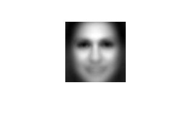
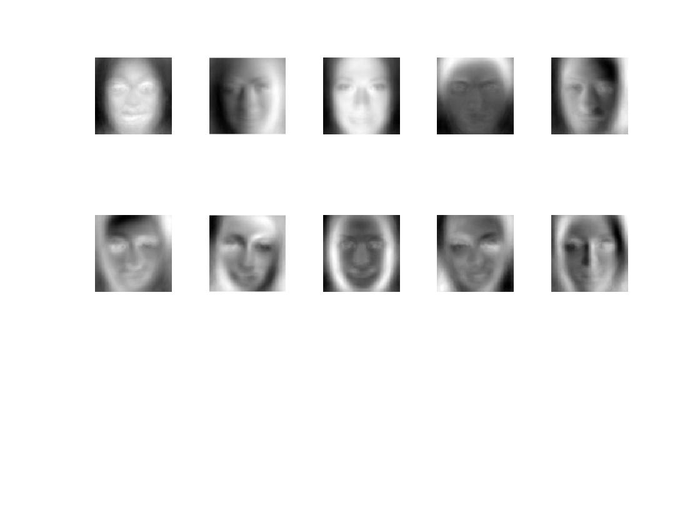
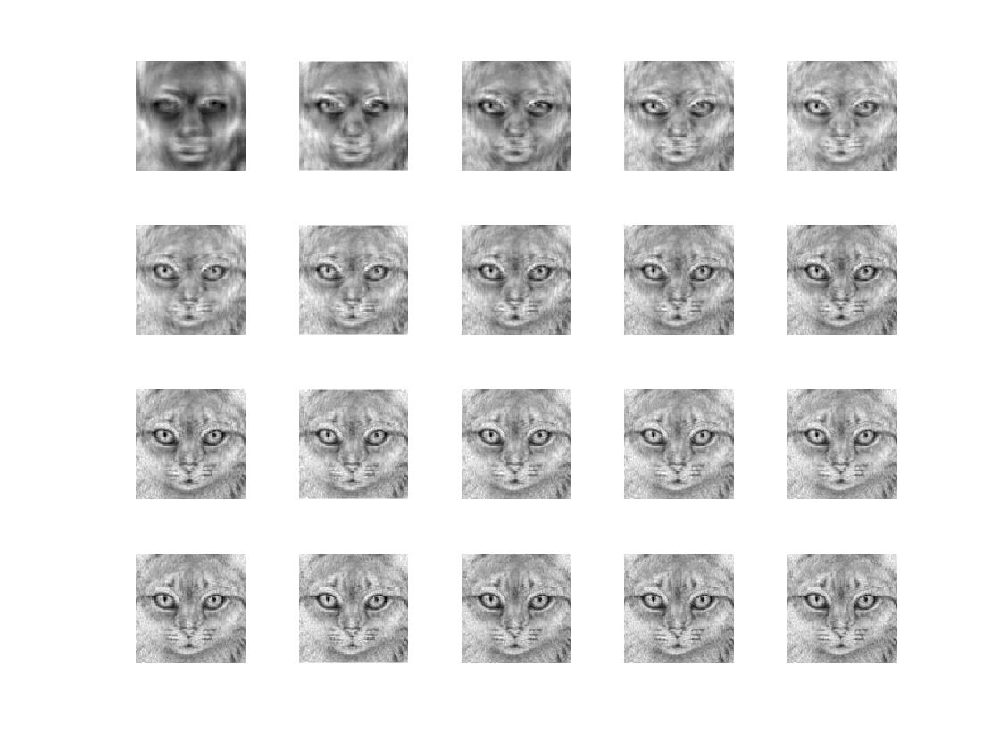
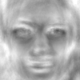

# What is Eigenfaces 🤖

Eigenfaces was introduced in the [paper](http://www.face-rec.org/algorithms/pca/jcn.pdf) in 1991, as a face recognition method based on PCA. 

I suggest reading about [PCA](https://en.wikipedia.org/wiki/Principal_component_analysis) first if you are not familiar with the idea.  😉 A good practice is to implement your version of PCA first, see my [attempt](PCA/README.md) here. 

## What did I do 👩🏻‍💻

This is an implementation of Eigenfaces in Matlab. I will show the reconstruction of some faces with eigenvectors.

1. Download the [FaceScrub](http://vintage.winklerbros.net/facescrub.html) dataset and convert them into grayscale if they are not already
2. Reshape the [m x n] images matrix into [(m x n) x 1] images vector. 
Here, I choose the dimension to be 100 * 100 just so my laptop doesn't burn itself 
3. Calculate the <b>mean face</b>, which is the most average face produced from all the face data we feed the program
4. Get <b>eigenvectors and eigenvalues</b> with the `svd` function in Matlab
5. Display the first 10 eigenvectors, which are some of the most prominent features 
6. The fun part - reconstruct face with the <b>covariance matrix</b>! Here I used eigenvectors with an interval of 20 to slowly build the mean face up to the original image

## Results

Mean Face 

Top 10 Eigenvectors 

Reconstructing face of a cat 🐱
 

You can see with more eigenvectors, the reconstruction seems increasingly closer to reality. However, <b> just by the first row (top 100 eigenvectors), we already have a good estimation of what does this cat look like</b>, which is kinda awesome because we just reduced the dimension from 100 * 100 to 100 vectors space without losing much information. 

Also, see the transformation from the mean face to 🐈 in gif
 

If you are interested in seeing more results, there's reconstructing faces of Scarlett Johansson and myself 🦄 in `results/`, or just try it out!

## Acknowledgments

* [FaceScrub Dataset](http://vintage.winklerbros.net/facescrub.html)
* Downloaded the data set with this [Python script](https://github.com/lightalchemist/FaceScrub)
* A good [blog](https://blog.cordiner.net/2010/12/02/eigenfaces-face-recognition-matlab/) explaning Eigenfaces face recognition
